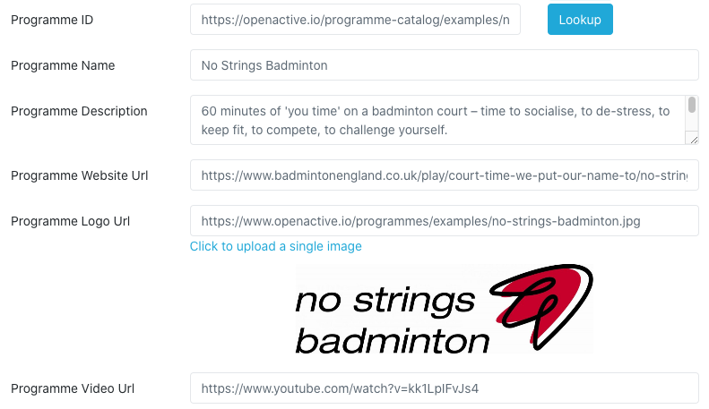

# OpenActive Programme Data Directory

This repository powers the [OpenActive Programme Data Directory](https://openactive.io/programme-catalog/).

## Introduction
Structured programmes, which are represented using the [`Brand`](https://openactive.io/modelling-opportunity-data/#adding-programmes-schema-brand-) type, are [included in the Modelling Opportunity Data 2.0 specification](https://openactive.io/modelling-opportunity-data/#programmes-and-brands).

Programmes are a great way for you to associate recognised brands with opportunities. They appear alongside the activity listing, and do not replace the other fields that you are publishing. For example: for a specific "Back to Netball" regular session, you might have already included a photo of the regular group of attendees as part of the `EventSeries` or `SessionSeries`, so that the session feels approachable - as per the OpenActive recommendation. Adding an additional `programme id` and associated details will also link a description of "Back to Netball" as a wider intiative, and include the "Back to Netball" logo.

## Example Usage
Programmes and this [Programme Data Directory](https://openactive.io/programme-catalog/) are featured in the Gladstone OpenActive Implementation and associated documentation:

## Contribution
To add programme data to this catalogue, simply add new rows to the table in the [`index.md`](index.md) file. It is published via GitHub pages automatically from the `master` branch.
